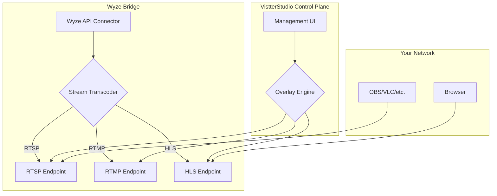

# VistterStudio

VistterStudio is a powerful, open-source solution for integrating Wyze cameras with professional streaming and broadcasting software. By leveraging the Wyze Bridge, VistterStudio provides a seamless way to ingest RTSP, RTMP, and HLS streams from your Wyze cameras, enabling you to use them in applications like OBS, VLC, or your own custom streaming solutions.

This project provides the core infrastructure to get you started with using your Wyze cameras for more than just home monitoring. With a simple Docker-based setup, you can have your cameras providing high-quality streams for your broadcasts, local recordings, or creative projects.

## Elevator Pitch

VistterStudio bridges the gap between affordable Wyze cameras and professional streaming setups. It's a Dockerized, easy-to-deploy solution that transforms your Wyze cameras into versatile streaming sources, complete with real-time overlay capabilities. Whether you're a local broadcaster, a streamer, or a developer, VistterStudio gives you the power to integrate high-quality, low-cost cameras into your workflow with minimal effort.

## Features

*   **Seamless Wyze Camera Integration**: Connect to your Wyze cameras and access their streams outside of the Wyze app.
*   **Multiple Streaming Protocols**: Provides streams in RTSP, RTMP, and HLS formats for maximum compatibility.
*   **Docker-Powered**: Easy to set up and run with a simple `docker-compose up`.
*   **Real-time Overlays**: (Future goal) Add custom real-time overlays to your camera streams.
*   **Multi-camera Support**: Manage and stream from multiple Wyze cameras at once.
*   **Scalable**: Designed to be lightweight and scalable for various use cases.

## Getting Started

Getting started with VistterStudio is as simple as cloning the repository and running Docker Compose.

### Prerequisites

*   Docker and Docker Compose installed on your machine.
*   Wyze camera(s) connected to your network.
*   Your Wyze username and password.

### Installation

1.  **Clone the repository:**
    ```bash
    git clone https://github.com/nickdnj/VistterStudio.git
    cd VistterStudio
    ```

2.  **Configure Wyze Bridge:**
    Create a `.env` file and add your Wyze credentials:
    ```
    WYZE_EMAIL=your_wyze_email@example.com
    WYZE_PASSWORD=your_wyze_password
    ```

3.  **Run with Docker Compose:**
    ```bash
    docker-compose up -d
    ```

4.  **Access your streams:**
    Once the containers are running, you can access the streams using the following URLs:
    *   **RTSP**: `rtsp://localhost:8554/{camera_nickname}`
    *   **RTMP**: `rtmp://localhost:1935/{camera_nickname}`
    *   **HLS**: `http://localhost:8888/{camera_nickname}/stream.m3u8`

## Architecture Overview

VistterStudio is built around the `mrlt8/wyze-bridge` Docker container. This container handles the connection to the Wyze API, authenticates with your credentials, and pulls the camera streams. It then exposes these streams on your local network using various protocols.

The planned architecture for VistterStudio will introduce a management UI and an overlay engine, which will interact with the streams provided by the Wyze Bridge.



## Contributing

Contributions are welcome! If you'd like to contribute to VistterStudio, please fork the repository and submit a pull request. For major changes, please open an issue first to discuss what you would like to change.

## License

This project is licensed under the MIT License - see the `LICENSE` file for details.
