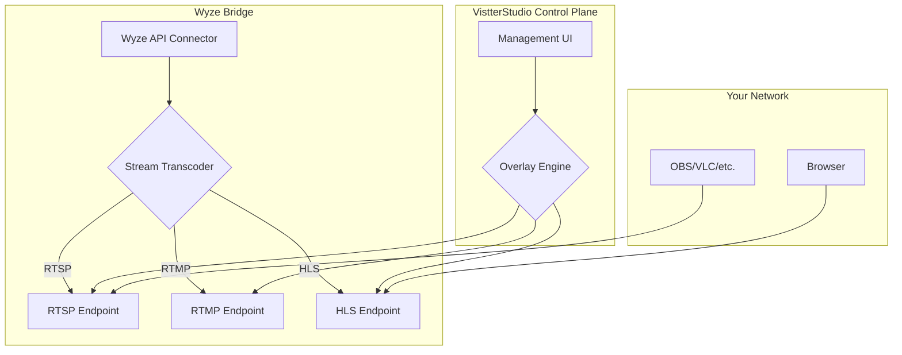

# VistterStudio

VistterStudio is a powerful, open-source solution for integrating Wyze cameras with professional streaming and broadcasting software. By leveraging the Wyze Bridge, VistterStudio provides a seamless way to ingest RTSP, RTMP, and HLS streams from your Wyze cameras, enabling you to use them in applications like OBS, VLC, or your own custom streaming solutions.

This project provides the core infrastructure to get you started with using your Wyze cameras for more than just home monitoring. With a simple Docker-based setup, you can have your cameras providing high-quality streams for your broadcasts, local recordings, or creative projects.

## Elevator Pitch

VistterStudio bridges the gap between affordable Wyze cameras and professional streaming setups. It's a Dockerized, easy-to-deploy solution that transforms your Wyze cameras into versatile streaming sources, complete with real-time overlay capabilities. Whether you're a local broadcaster, a streamer, or a developer, VistterStudio gives you the power to integrate high-quality, low-cost cameras into your workflow with minimal effort.

## ✨ Features

*   **🎥 Beautiful Web Interface**: Modern React-based streaming control panel with dark theme
*   **📺 Live Camera Grid**: View all your Wyze cameras in a responsive grid layout
*   **🎛️ Stream Mixer Mode**: Multi-camera composition and mixing interface
*   **🔄 Multiple Streaming Protocols**: RTSP, RTMP, and HLS formats for maximum compatibility
*   **🐳 Docker-Powered**: Complete containerized solution with one-command deployment
*   **⚡ Real-time Status**: Live camera status, quality indicators, and stream metadata
*   **🔗 Professional Integration**: Easy integration with OBS, VLC, and other streaming software
*   **📱 Responsive Design**: Works perfectly on desktop, tablet, and mobile devices
*   **🔐 Secure API**: CORS-enabled backend with proper authentication handling

## 🚀 Getting Started

VistterStudio provides a complete streaming solution with a beautiful web interface for managing your Wyze cameras.

### Prerequisites

*   Docker and Docker Compose installed on your machine
*   Wyze camera(s) connected to your network
*   Wyze API credentials (API_ID and API_KEY from [Wyze Developer Console](https://developer-api-console.wyze.com/#/))

### Installation

1.  **Clone the repository:**
    ```bash
    git clone https://github.com/nickdnj/VistterStudio.git
    cd VistterStudio
    ```

2.  **Get Wyze API credentials:**
    - Visit [Wyze Developer Console](https://developer-api-console.wyze.com/#/)
    - Create an API Key and note your API_ID and API_KEY

3.  **Configure environment:**
    Create a `.env` file with your Wyze credentials:
    ```bash
    cat > .env << EOF
    WYZE_EMAIL=your_wyze_email@example.com
    WYZE_PASSWORD=your_wyze_password
    API_ID=your_api_id
    API_KEY=your_api_key
    WB_AUTH=False
    EOF
    ```

4.  **Start all services:**
    ```bash
    docker-compose up -d
    ```

5.  **Access VistterStudio:**
    - **🎥 VistterStudio UI:** http://localhost:19000
    - **📡 Backend API:** http://localhost:18080
    - **🔗 Wyze Bridge API:** http://localhost:15000

### Stream Access

Each camera provides multiple stream formats:
- **HLS (Web):** `http://localhost:18888/{camera-name}/`
- **RTSP (OBS/VLC):** `rtsp://localhost:18554/{camera-name}`
- **RTMP (Streaming):** `rtmp://localhost:11935/{camera-name}`

### Verification

Test your setup:
```bash
# Check if cameras are detected
curl http://localhost:18080/api/cams

# Verify frontend can access API
curl -H "Origin: http://localhost:19000" http://localhost:18080/api/cams
```

## Architecture Overview

VistterStudio is built around the `mrlt8/wyze-bridge` Docker container. This container handles the connection to the Wyze API, authenticates with your credentials, and pulls the camera streams. It then exposes these streams on your local network using various protocols.

The planned architecture for VistterStudio will introduce a management UI and an overlay engine, which will interact with the streams provided by the Wyze Bridge.



## Contributing

Contributions are welcome! If you'd like to contribute to VistterStudio, please fork the repository and submit a pull request. For major changes, please open an issue first to discuss what you would like to change.

## License

This project is licensed under the AGPL-3.0 License - see the `LICENSE` file for details.
