# VistterStudio

VistterStudio is a comprehensive, open-source solution for integrating RTMP IP cameras with professional streaming and broadcasting workflows. With a modern timeline-based interface, VistterStudio transforms your IP cameras (Reolink, Hikvision, Dahua, etc.) into powerful video production assets with real-time editing capabilities.

This project provides a complete video production environment where you can add multiple RTMP cameras, arrange them on a timeline, and create sophisticated multi-camera productions with positioning controls, zoom/pan functionality, and real-time overlays.

## ✨ What Makes VistterStudio Special

VistterStudio transforms IP cameras into professional streaming assets through a modern timeline-based interface. Whether you're a broadcaster, content creator, or system integrator, VistterStudio gives you the power to create sophisticated multi-camera productions with affordable IP cameras and intuitive drag-and-drop editing.

## ✨ Core Features

### 🎥 Timeline-Based Video Production
*   **Multi-Track Timeline**: Drag cameras and assets onto video, audio, and overlay tracks
*   **Real-Time Preview**: Live preview of your timeline composition as you edit
*   **Professional Controls**: Play, pause, stop, seek, and loop functionality
*   **Drag & Drop Interface**: Intuitive workflow for rapid content creation

### 📹 RTMP Camera Integration  
*   **Universal IP Camera Support**: Works with Reolink, Hikvision, Dahua, and other RTMP cameras
*   **Secure Credential Management**: Encrypted storage of camera usernames and passwords
*   **Auto URL Generation**: Dynamic RTMP stream URL construction with authentication
*   **Connection Monitoring**: Real-time camera status and stream health indicators

### 🎛️ Advanced Stream Controls
*   **Positioning Controls**: X/Y coordinate adjustment for precise camera placement
*   **Digital Zoom & Pan**: 50%-300% scale control for focus and framing
*   **Opacity & Blending**: Transparency controls for overlay effects
*   **Real-Time Updates**: All adjustments apply instantly to the live preview

### 🎨 Professional Production Tools
*   **Asset Management**: Built-in media library for images, videos, and audio
*   **Effect Systems**: Transition effects (fade, slide, scale, zoom) between clips
*   **Export & Rendering**: Timeline export capabilities for post-production
*   **Project Management**: Save and load timeline projects

### 🔧 Developer & Integration Features
*   **RESTful API**: Complete API for camera management and stream control
*   **Docker Deployment**: Containerized solution for easy deployment and scaling
*   **Modular Architecture**: Extensible design for custom integrations
*   **Web-Based Interface**: No desktop software required - runs in any modern browser

## 🚀 Quick Start

Get up and running with VistterStudio in minutes. No complex setup required!

### Prerequisites

*   **Docker & Docker Compose** - For containerized deployment
*   **RTMP IP Camera(s)** - Reolink, Hikvision, Dahua, or any camera supporting RTMP
*   **Camera Credentials** - Username and password for your IP cameras

### Installation

1.  **Clone the repository:**
    ```bash
    git clone https://github.com/nickdnj/VistterStudio.git
    cd VistterStudio
    ```

2.  **Start the development environment:**
    ```bash
    # Start the backend server
    cd server
    npm install
    npm start

    # In a new terminal, start the frontend
    cd frontend  
    npm install
    npm run dev
    ```

3.  **Access VistterStudio:**
    - **🎥 VistterStudio Interface:** http://localhost:5173
    - **📡 Backend API:** http://localhost:8080

### Adding Your First RTMP Camera

1. **Open VistterStudio** in your browser (http://localhost:5173)
2. **Navigate to the Camera tab** in the left sidebar
3. **Click "Add Camera"** in the RTMP Cameras section
4. **Configure your camera:**
   ```
   Camera Name: My Reolink Camera
   Host/IP: 192.168.1.100
   Port: 1935
   Channel: 0
   Stream: 2  
   Username: admin
   Password: your_camera_password
   ```
5. **Click "Add Camera"** - Your camera will appear in the camera list
6. **Drag your camera** from the list onto the timeline to start editing!

### Example RTMP URL Format

VistterStudio automatically generates RTMP URLs in this format:
```
rtmp://192.168.86.23:1935/bcs/channel0_ext.bcs?channel=0&stream=2&user=username&password=password
```

## 🎬 Using VistterStudio

### Timeline Production Workflow

1. **Add Cameras**: Configure your RTMP cameras in the Camera Drawer
2. **Create Timeline**: Drag cameras onto video tracks in the timeline
3. **Adjust Positioning**: Use the Properties Panel to control camera placement and zoom
4. **Add Assets**: Import images, videos, and audio to enhance your production  
5. **Apply Effects**: Add transitions and overlays between clips
6. **Preview & Export**: Real-time preview with export capabilities

### Camera Controls

When you select an RTMP camera clip on the timeline, the Properties Panel provides:

- **Position Controls**: X/Y sliders (-100 to +100) for camera placement
- **Zoom Control**: Scale slider (50% to 300%) for digital zoom/pan
- **Opacity Control**: Transparency slider (0% to 100%) for overlay effects
- **Timing Controls**: Start time, duration, and transition effects

### API Testing

Test your RTMP camera integration:
```bash
# Test adding a camera
curl -X POST http://localhost:8080/api/rtmp/cameras \
  -H "Content-Type: application/json" \
  -d '{
    "name": "Test Camera",
    "host": "192.168.1.100", 
    "port": 1935,
    "channel": 0,
    "stream": 2,
    "username": "admin",
    "password": "password"
  }'

# List all cameras
curl http://localhost:8080/api/rtmp/cameras

# Get stream URL for a camera
curl http://localhost:8080/api/rtmp/cameras/{camera-id}/stream
```

## 🏗️ Architecture Overview

VistterStudio provides a complete video production environment with a modern web-based interface for RTMP camera integration and timeline-based editing.

```mermaid
flowchart TD
    subgraph "🖥️ Frontend (React + Vite)"
        A[Timeline Editor] --> B[Camera Drawer]
        B --> C[Properties Panel] 
        C --> D[Asset Manager]
        D --> E[Preview Window]
    end

    subgraph "⚙️ Backend (Node.js + Express)"  
        F[RTMP Camera API] --> G[Credential Management]
        G --> H[Stream URL Generator]
        H --> I[Asset Management]
        I --> J[File Storage]
    end

    subgraph "📹 IP Camera Network"
        K[Reolink Camera] --> L[RTMP Stream]
        M[Hikvision Camera] --> N[RTMP Stream] 
        O[Other IP Cameras] --> P[RTMP Stream]
    end

    A --> F
    L --> H
    N --> H  
    P --> H

    subgraph "🎯 Integration Points"
        Q[Browser Client] --> A
        R[Mobile Devices] --> A
        S[REST API] --> F
        T[Docker Deployment] --> F
    end
```



### Key Components

- **🎬 Timeline Engine**: Multi-track timeline with drag-and-drop functionality
- **📹 Camera Manager**: RTMP camera configuration and credential storage  
- **🎛️ Stream Controller**: Real-time positioning, zoom, and opacity controls
- **💾 Asset System**: Media library for images, videos, and audio files
- **🔌 API Layer**: RESTful endpoints for camera and asset management
- **🐳 Docker Ready**: Containerized deployment for production environments

### Data Flow

1. **Camera Configuration**: Users add RTMP cameras through the web interface
2. **Credential Storage**: Backend securely stores camera authentication  
3. **Stream Integration**: Timeline engine requests stream URLs from API
4. **Real-Time Control**: Properties panel adjustments update live preview
5. **Timeline Composition**: Multiple cameras and assets compose final output

## 🧪 Testing & Validation

VistterStudio includes comprehensive testing tools for validating RTMP camera integration:

### Automated Testing

Run the included test script to validate your setup:
```bash
# Test RTMP camera integration
node test_rtmp_camera.js
```

This test will:
- ✅ Add a test RTMP camera configuration
- ✅ Generate and validate stream URLs  
- ✅ Test API endpoints functionality
- ✅ Verify credential handling

### Manual Testing Checklist

- [ ] Camera appears in Camera Drawer after adding
- [ ] Camera can be dragged onto timeline tracks
- [ ] Properties Panel shows RTMP camera controls
- [ ] Position controls (X/Y) update preview in real-time
- [ ] Zoom controls (50%-300%) work correctly
- [ ] Opacity controls affect transparency
- [ ] Camera credentials persist between sessions

## 📋 Supported Camera Brands

VistterStudio works with any IP camera that supports RTMP streaming:

### ✅ Tested & Verified
- **Reolink** - All models with RTMP support
- **Hikvision** - Professional IP camera series
- **Dahua** - Enterprise and consumer models

### 🔧 Configuration Examples

**Reolink Camera:**
```
Port: 1935
Channel: 0
Stream: 2 (sub-stream) or 0 (main stream)
URL Format: /bcs/channel{channel}_ext.bcs
```

**Hikvision Camera:**
```
Port: 1935  
Channel: 1
Stream: 1
URL Format: /Streaming/Channels/{channel}01
```

**Generic RTMP Camera:**
```
Port: 1935 (standard RTMP port)
Path: varies by manufacturer
Authentication: username/password in URL parameters
```

## 🚀 Production Deployment

### Docker Deployment (Recommended)

```bash
# Build and deploy with Docker Compose
docker-compose up -d

# Or build manually
docker build -t vistterstudio .
docker run -p 8080:8080 -p 5173:5173 vistterstudio
```

### Environment Variables

Configure VistterStudio with these environment variables:

```bash
# Server Configuration
PORT=8080
NODE_ENV=production

# Frontend Configuration  
VITE_API_BASE_URL=http://localhost:8080/api

# Security (Optional)
RTMP_ENCRYPT_KEY=your-encryption-key-here
SESSION_SECRET=your-session-secret
```

## 🛡️ Security Considerations

- **Credential Storage**: Camera passwords are stored securely in the backend
- **API Access**: CORS protection enabled for frontend-only access
- **Network Security**: Ensure RTMP cameras are on a secure network
- **HTTPS**: Use HTTPS in production for encrypted credential transmission

## 🔧 Troubleshooting

### Common Issues

**Camera Won't Connect:**
- Verify IP address and port are correct
- Check camera RTMP is enabled in camera settings
- Ensure username/password are correct
- Test camera accessibility from network

**Timeline Performance:**
- Reduce number of simultaneous camera feeds
- Use sub-streams (lower quality) for better performance
- Check network bandwidth to cameras

**API Errors:**
- Verify backend server is running on correct port
- Check CORS configuration for frontend domain
- Ensure camera credentials are properly formatted

### Debug Mode

Enable debug logging:
```bash
DEBUG=vistterstudio:* npm start
```

## 📚 API Documentation

Complete API documentation for integrating with VistterStudio:

### Camera Management Endpoints

```bash
GET    /api/rtmp/cameras           # List all cameras
POST   /api/rtmp/cameras           # Add new camera  
GET    /api/rtmp/cameras/:id/stream # Get stream URL
DELETE /api/rtmp/cameras/:id       # Delete camera
```

### Asset Management Endpoints

```bash
GET    /api/assets                 # List all assets
POST   /api/assets/upload          # Upload new asset
DELETE /api/assets/:id             # Delete asset
```

See the [API Documentation](docs/API.md) for complete details.

## 🎯 Roadmap

### Upcoming Features

- 🔴 **Live Streaming Output**: Direct streaming to RTMP destinations
- 🎨 **Advanced Effects**: More transition types and visual effects  
- 📱 **Mobile Optimization**: Enhanced mobile interface
- 🤖 **AI Integration**: Auto-framing and scene detection
- 🔧 **Plugin System**: Extensible architecture for custom effects

### Version History

- **v2.0.0** - RTMP Camera Integration with Timeline Editor
- **v1.0.0** - Initial Wyze Bridge Integration (deprecated)

## 🤝 Contributing

We welcome contributions! Here's how to get started:

1. **Fork the repository** on GitHub
2. **Create a feature branch**: `git checkout -b feature/amazing-feature`
3. **Make your changes** and test thoroughly
4. **Commit your changes**: `git commit -m 'Add amazing feature'`
5. **Push to the branch**: `git push origin feature/amazing-feature`
6. **Open a Pull Request** with a clear description

### Development Guidelines

- Follow existing code style and patterns
- Add tests for new functionality
- Update documentation for API changes
- Test with multiple camera brands if possible

## 📞 Support & Community

- 🐛 **Bug Reports**: [GitHub Issues](https://github.com/nickdnj/VistterStudio/issues)
- 💡 **Feature Requests**: [GitHub Discussions](https://github.com/nickdnj/VistterStudio/discussions)
- 📖 **Documentation**: [Wiki](https://github.com/nickdnj/VistterStudio/wiki)
- 💬 **Community**: [Discord Server](https://discord.gg/vistterstudio)

## ⚖️ License

This project is licensed under the **AGPL-3.0 License** - see the [LICENSE](LICENSE) file for details.

**What this means:**
- ✅ Free to use, modify, and distribute
- ✅ Commercial use allowed
- 📋 Must provide source code for any modifications
- 🔄 Must use same license for derivative works

---

**⭐ If VistterStudio helps your projects, please give us a star on GitHub!**
