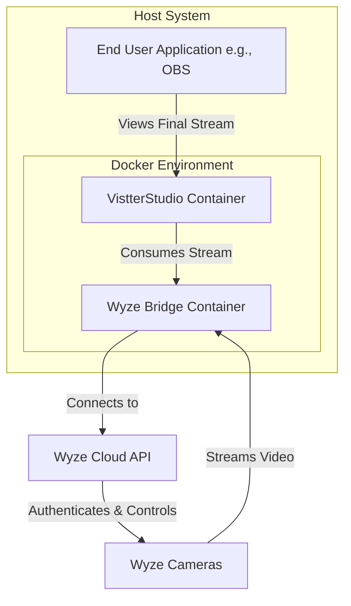

# Software Architecture Document (SAD): VistterStudio + Wyze Bridge Integration

This document outlines the software architecture for VistterStudio, a system for integrating Wyze cameras into professional streaming workflows.

## 1. System Design

The system is designed as a modular, containerized application that leverages the existing `docker-wyze-bridge` project. VistterStudio itself will act as a control plane and overlay engine, while the Wyze Bridge handles the core functionality of connecting to and streaming from the cameras.

The integration is achieved through network communication between the containers. VistterStudio will consume the streams produced by the Wyze Bridge, process them (e.g., add overlays), and then expose a final, modified stream.

## 2. Architecture Pattern

The architecture is a **microservices-oriented pattern**, with a clear separation of concerns between the two main components:

*   **Wyze Bridge (Microservice):** A dedicated service for camera communication and stream transcoding. It is treated as a third-party dependency.
*   **VistterStudio (Microservice):** A separate service that will provide a user interface, an overlay engine, and a management API.

This will all be managed and orchestrated using **Docker Compose**, which defines the services, networks, and volumes required to run the application.

## 3. State Management

*   **Camera State:** The state of the cameras (online, offline, streaming status) will be managed by the Wyze Bridge container. VistterStudio will query the Wyze Bridge's API (`http://localhost:5000/status`) to get the current state.
*   **UI/Application State (Phase 2):** When a web UI is developed, its state (e.g., selected camera, overlay settings) will be managed within the browser's session storage for transient state, and potentially a lightweight database or JSON file for persistent configuration.
*   **Configuration:** All configuration, including Wyze credentials and overlay settings, will be stored in environment variables (`.env` file) or a configuration file (`config.json`), and will not be hardcoded.

## 4. Data Flow

1.  **Initialization:** The `docker-wyze-bridge` container starts, authenticates with the Wyze API using the provided credentials, and discovers the user's cameras.
2.  **Stream Request:** When an end-user application (like OBS or VLC) requests a stream from a specific camera, it connects to one of the Wyze Bridge's endpoints (RTSP, RTMP, or HLS).
3.  **Video Ingest:** The Wyze Bridge pulls the encrypted video stream from the Wyze camera through the Wyze cloud.
4.  **Transcoding & Exposure:** The bridge decrypts and transcodes the stream into the requested format and exposes it on the local network.
5.  **Overlay Processing (Phase 2):** The VistterStudio container will ingest this local stream, apply the configured overlays using a video processing library (e.g., FFmpeg), and then expose a new set of stream endpoints.
6.  **Final Output:** The end-user application connects to the VistterStudio stream endpoint to receive the final video with overlays.

## 5. Technical Stack

*   **Containerization:** Docker, Docker Compose
*   **Core Bridge:** `mrlt8/wyze-bridge` (Python-based)
*   **VistterStudio Backend (Phase 2):** Node.js with Express.js (for the API and UI), or Python with Flask/FastAPI.
*   **VistterStudio Frontend (Phase 2):** A modern JavaScript framework like React, Vue, or Svelte.
*   **Video Processing (Phase 2):** FFmpeg (likely via a library like `fluent-ffmpeg` for Node.js or a Python equivalent).

## 6. Authentication

*   **Wyze Authentication:** Handled entirely by the `docker-wyze-bridge` container, which uses the credentials from the `.env` file to authenticate with the Wyze API.
*   **VistterStudio UI Authentication (Phase 2):** If the web UI requires user-specific settings, a simple authentication mechanism (e.g., a single password set in the `.env` file) will be implemented to protect access to the control panel.

## 7. API/Route Design (Conceptual)

The system will expose two sets of APIs/routes:

### Wyze Bridge API (provided by `mrlt8/wyze-bridge`)

*   `GET /status`: Returns the status of all cameras.
*   `GET /cams`: Returns a list of all available cameras.
*   ... and other endpoints as documented in the [Wyze Bridge project](https://github.com/mrlt8/docker-wyze-bridge).

### VistterStudio API (Phase 2)

*   `GET /api/streams`: Returns a list of available streams from the Wyze Bridge, along with their VistterStudio-specific URLs.
*   `GET /api/overlays`: Returns a list of configured overlays.
*   `POST /api/overlays`: Creates a new overlay.
*   `PUT /api/overlays/{id}`: Updates an existing overlay.
*   `DELETE /api/overlays/{id}`: Deletes an overlay.
*   `POST /api/streams/{camera_nickname}/apply-overlay`: Applies an overlay to a specific camera stream.

## 8. Database/Config Design

*   **Phase 1:** No database is required. Configuration is handled entirely through the `.env` file.
*   **Phase 2:** For persisting overlay settings and other user configurations, a simple solution will be used.
    *   **Option A: JSON file:** A `config.json` file mounted as a Docker volume to persist settings.
    *   **Option B: SQLite:** A lightweight, file-based SQL database, also mounted as a volume.

The choice between these options will depend on the complexity of the configuration that needs to be stored. A JSON file is preferred for its simplicity.
