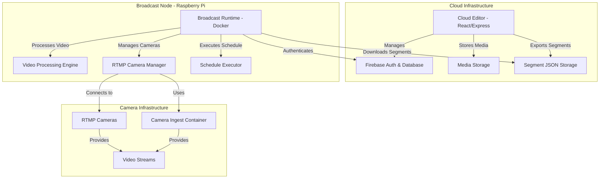

# Software Architecture Document (SAD): VistterStudio Cloud Editor + Broadcast Node

This document outlines the software architecture for VistterStudio, a two-component system that transforms scenic business locations into compelling digital destinations through automated place-based visual storytelling.

## 1. System Design

VistterStudio is architected as a distributed system with two core components:

1. **Cloud Editor (Web UI):** A modern web application for place-based visual storytelling timeline editing, promotional overlay management, and scenic location media configuration
2. **Broadcast Node (Raspberry Pi):** A headless runtime deployed at scenic business locations that executes pre-defined visual storytelling segments based on JSON schedules

The system operates on a **cloud-first, pull-based model** where scenic business owners create automated livestreams in the cloud, and broadcast nodes at their locations fetch and execute visual storytelling segments to showcase their scenic view.



## 2. Architecture Pattern

The architecture follows a **distributed microservices pattern** with clear separation between cloud-based editing and edge-based execution:

*   **Cloud Editor (Web Application):** A React-based SPA with Express.js backend, providing timeline editing, media management, and segment export capabilities
*   **Broadcast Node (Edge Runtime):** A Dockerized headless application that executes pre-defined video segments on Raspberry Pi hardware
*   **Firebase Backend:** Handles authentication, data persistence, and real-time synchronization between components

The system uses **Docker Compose** for local development and **Google Cloud Run** for cloud deployment, with broadcast nodes operating independently in the field.

## 3. State Management

*   **Cloud Editor State:** Timeline data, media metadata, and user preferences are managed by Firebase Firestore with real-time synchronization. Local UI state uses React Context and Zustand for immediate responsiveness.
*   **Broadcast Node State:** Segment schedules, camera configurations, and execution status are stored locally in SQLite. Authentication tokens and sync timestamps are managed by the Firebase SDK.
*   **Camera State:** RTMP camera status and camera ingest container connectivity are monitored locally on each broadcast node. Camera credentials are stored securely in environment variables.
*   **Multi-User State:** User authentication, project sharing, and collaborative editing are handled by Firebase Auth and Firestore security rules.

## 4. Data Flow

### Cloud Editor Workflow
1.  **User Authentication:** Scenic business owners log into the cloud editor via Firebase Auth with multi-user support
2.  **Visual Storytelling Timeline:** Business owners create automated livestreams showcasing their scenic location using static thumbnails and drag-and-drop interface
3.  **Static Media Management:** PNG/JPEG images, promotional graphics, logos, and overlay media are uploaded to Firebase Storage and referenced in visual storytelling timelines
4.  **Dynamic Gadget Creation:** Users design weather boxes, tide tables, and other data-driven overlays with placeholders (e.g., `{temp}`, `{wind}`, `{tide}`) for real-time data
5.  **Advertising Integration:** Users configure ad API endpoints and create ad placeholders with scheduling and rotation logic for monetizable overlays
6.  **API Integration:** Cloud editor integrates with external APIs (weather, NOAA tide data, ad services) to configure dynamic data sources for gadgets and ads
7.  **Media Export Pipeline:** Static media are exported as PNG/JPEG files and packaged with timeline JSON containing media references, API instructions, and ad scheduling metadata
8.  **Cloud Storage:** JSON segments with media metadata and ad configuration are stored in Firebase Firestore with scheduling information for scenic business locations

### Broadcast Node Workflow
1.  **Authentication:** Broadcast node at scenic business location authenticates with Firebase using stored credentials
2.  **Segment Discovery:** Node queries Firebase for available visual storytelling segments and downloads JSON definitions with media references and ad configuration
3.  **Media Synchronization:** Node downloads static PNG/JPEG media from Firebase Storage and caches them locally for timeline execution
4.  **Dynamic Data Resolution:** Node fetches real-time data from configured APIs (weather, tide, ads) and renders dynamic gadgets and ads with live data
5.  **Ad Management:** Node processes ad rotation schedules, fetches dynamic ad content from ad APIs, and handles time-bound ad slots
6.  **Schedule Execution:** Node interprets JSON segments and executes automated livestreams showcasing the scenic location based on timing
7.  **Camera Integration:** Node connects to existing security cameras, webcams, or IP cameras at the scenic business location
8.  **Video Processing:** FFmpeg processes scenic camera feeds with static overlays, dynamic gadgets, and ad overlays according to segment specifications
9.  **Output Streaming:** Processed scenic livestream with real-time overlays and ads is streamed to configured outputs (RTMP, HLS, or local display) to showcase the location

## 5. Technical Stack

### Cloud Editor
*   **Frontend:** React 18+ with TypeScript, Zustand for state management, Tailwind CSS for styling
*   **Backend:** Node.js with Express.js, Firebase Admin SDK
*   **Database:** Firebase Firestore for real-time data synchronization
*   **Storage:** Firebase Storage for media and media files
*   **Authentication:** Firebase Auth with multi-user support
*   **Deployment:** Google Cloud Run with Docker containers

### Broadcast Node
*   **Runtime:** Node.js with TypeScript in Docker container
*   **Video Processing:** FFmpeg with fluent-ffmpeg wrapper
*   **Database:** SQLite for local state and segment caching
*   **Camera Integration:** RTMP client libraries, camera ingest container
*   **Authentication:** Firebase SDK for cloud synchronization
*   **Platform:** Raspberry Pi with Docker support

### Shared Infrastructure
*   **Containerization:** Docker, Docker Compose for local development
*   **Camera Bridge:** Generic camera ingest container (Python-based) for camera integration
*   **Video Formats:** RTMP, HLS, WebRTC for camera inputs; RTMP, HLS for outputs

## 6. Media Management System

### Static Media Pipeline
*   **Media Upload:** Users upload PNG/JPEG images, promotional graphics, logos, and overlay media to Firebase Storage
*   **Media Processing:** Images are processed and optimized for broadcast use with consistent format (PNG standard)
*   **Media Metadata:** Media information (dimensions, file size, upload date) is stored in Firestore with unique identifiers
*   **Media Export:** Static media are packaged with timeline JSON and downloaded by broadcast nodes during sync

### Dynamic Data Integration
*   **API Configuration:** Cloud editor allows users to configure external API endpoints for weather, tide data, and ad services
*   **Gadget Templates:** Pre-built templates for weather boxes, tide tables, and time displays with placeholder system
*   **Ad Templates:** Pre-built templates for ad overlays with placeholder system for dynamic ad content (creative, copy, links)
*   **Data Mapping:** JSON configuration maps API responses to placeholder variables (e.g., `{temp}`, `{wind}`, `{tide}`, `{ad_creative}`)
*   **Ad Scheduling:** Time-based ad slot configuration with rotation schedules and time-bound ad display (e.g., 6-9 PM only)
*   **Real-Time Rendering:** Broadcast nodes fetch live data and render dynamic overlays and ads as PNG images for FFmpeg processing

### Media Synchronization
*   **Cloud-to-Node Sync:** Broadcast nodes periodically download updated media and timeline configurations
*   **Local Caching:** Static and dynamic media are cached locally on broadcast nodes for offline operation
*   **Version Control:** Media versions are tracked to ensure broadcast nodes use the latest content
*   **Sync Status Reporting:** Broadcast nodes report media sync status and any missing media to the cloud

### Advertising Management System
*   **Ad API Integration:** Cloud editor connects to external ad service APIs for dynamic ad content delivery
*   **Static Ad Management:** Upload and manage static ad creatives (PNG/JPEG) with metadata and scheduling information
*   **Ad Rotation Logic:** Configure ad rotation schedules (e.g., every 5 minutes) and time-bound ad slots
*   **Ad Placeholder System:** Dynamic ads use placeholders (e.g., `{ad_creative}`, `{ad_copy}`, `{ad_link}`) for real-time content
*   **Ad Scheduling:** Time-based ad configuration with start/end times, recurrence patterns, and audience targeting
*   **Ad Media Sync:** Broadcast nodes download static ad creatives and fetch dynamic ad content from ad APIs
*   **Ad Performance Tracking:** Monitor ad display metrics, rotation frequency, and engagement data

## 7. Authentication

*   **Cloud Editor Authentication:** Firebase Auth provides multi-user authentication with email/password, Google OAuth, and custom token support. Users can create accounts, share projects, and collaborate on timelines.
*   **Broadcast Node Authentication:** Each broadcast node authenticates with Firebase using service account credentials stored securely in environment variables. Nodes can be assigned to specific projects and user accounts.
*   **Camera Authentication:** RTMP camera credentials and camera ingest container authentication are handled locally on each broadcast node using environment variables and secure credential storage.
*   **API Security:** Cloud editor APIs use Firebase Auth tokens for authorization, with Firestore security rules controlling data access based on user permissions.

## 7. API/Route Design

### Cloud Editor API (Express.js + Firebase)

**Authentication & User Management:**
*   `POST /api/auth/login`: User authentication via Firebase Auth
*   `POST /api/auth/logout`: User logout and token invalidation
*   `GET /api/users/profile`: Get current user profile and permissions

**Project & Timeline Management:**
*   `GET /api/projects`: List user's projects with metadata
*   `POST /api/projects`: Create new project
*   `GET /api/projects/{id}/timeline`: Get timeline data for project
*   `PUT /api/projects/{id}/timeline`: Update timeline with real-time sync
*   `POST /api/projects/{id}/export`: Export timeline as JSON segment

**Media Management:**
*   `POST /api/media/upload`: Upload images, videos, audio files
*   `GET /api/media/{id}`: Get media metadata and download URL
*   `DELETE /api/media/{id}`: Delete media and update references

**Segment Management:**
*   `GET /api/segments`: List available segments for broadcast nodes
*   `POST /api/segments`: Publish new segment from timeline
*   `PUT /api/segments/{id}`: Update segment metadata and scheduling
*   `DELETE /api/segments/{id}`: Remove segment from distribution

### Broadcast Node API (Local)

**Segment Synchronization:**
*   `GET /api/sync/segments`: Download available segments from cloud
*   `POST /api/sync/status`: Report execution status and health
*   `GET /api/sync/schedule`: Get scheduled segments for execution

**Camera Management:**
*   `GET /api/cameras`: List configured RTMP cameras and camera ingest container status
*   `POST /api/cameras/test`: Test camera connectivity
*   `GET /api/cameras/{id}/stream`: Get camera stream URL for processing

**Execution Control:**
*   `POST /api/execute/start`: Start segment execution
*   `POST /api/execute/stop`: Stop current execution
*   `GET /api/execute/status`: Get current execution status and progress

## 8. Database/Config Design

### Cloud Editor Database (Firebase Firestore)

**Collections:**
*   `users`: User profiles, preferences, and authentication data
*   `projects`: Project metadata, sharing permissions, and collaboration settings
*   `timelines`: Timeline data with real-time synchronization for collaborative editing
*   `media`: Media file metadata, thumbnails, and storage references
*   `segments`: Exported JSON segments with scheduling and distribution metadata
*   `broadcast_nodes`: Registered broadcast node information and status

**Security Rules:** Firestore security rules control access based on user authentication and project ownership, enabling secure multi-user collaboration.

### Broadcast Node Database (SQLite)

**Tables:**
*   `segments`: Cached segment JSON data and execution metadata
*   `cameras`: Local camera configurations and connection status
*   `execution_log`: Execution history and performance metrics
*   `sync_status`: Last sync timestamps and cloud connectivity status

**Configuration:** Environment variables for Firebase credentials, camera settings, and node identification. SQLite database for local state persistence and offline operation.

### Data Synchronization

**Real-time Sync:** Cloud editor uses Firestore real-time listeners for collaborative editing and immediate updates across all connected clients.

**Batch Sync:** Broadcast nodes periodically sync with cloud to download new segments and report status, with configurable sync intervals and retry logic.

## 9. Timeline Architecture (v2)

### Time Domain Model

The timeline operates on a **time-first principle** where all positioning and scaling is calculated based on time values, not pixel dimensions.

#### TimeScale Class

The `TimeScale` class handles all time↔pixel conversions:

```typescript
class TimeScale {
  constructor(
    public msPerPx: number,        // Milliseconds per pixel
    public viewStartMs: number,    // Start time of visible area
    public contentOffsetPx: number // Width of labels column (192px)
  )
  
  xOf(timeMs: number): number     // Convert time to pixel position
  tOf(pixelX: number): number     // Convert pixel to time
  setVisibleDuration(durationMs: number, anchorPx?: number): TimeScale
  panByPixels(deltaX: number): TimeScale
}
```

**Key Benefits:**
- Consistent positioning at all zoom levels
- No CSS transform scaling hacks
- Precise time calculations
- Easy snapping and alignment

### Timeline State Management

Uses Zustand for centralized state management with Firebase Firestore for cloud synchronization:

```typescript
interface TimelineState {
  // Time domain
  currentTimeMs: number;
  isPlaying: boolean;
  playbackRate: PlaybackRate;
  
  // Viewport
  viewport: TimelineViewport;
  timeScale: TimeScale;
  
  // Content
  tracks: Track[];
  clips: Clip[];
  selectedClipId: string | null;
  
  // Interaction state
  dragState: DragState;
  
  // Cloud collaboration
  collaborators: Collaborator[];
  syncStatus: SyncStatus;
  offlineMode: boolean;
}
```

**Store Features:**
- Real-time playback engine using `requestAnimationFrame`
- Firebase Firestore integration for cloud synchronization
- Real-time collaboration with conflict resolution
- Offline mode with local state persistence
- Optimized updates with selective subscriptions
- Undo/redo capability with cloud sync

### Timeline Component Architecture

#### Timeline (Main Container)
- Handles viewport management and scrolling
- Coordinates all child components
- Manages wheel events for zoom/pan
- Provides resize observer for responsive behavior

#### HeaderRuler
- Generates "nice" tick intervals based on zoom level
- Renders time labels at consistent font sizes
- Updates automatically when viewport changes
- Supports multiple time formats

#### Playhead
- Draggable red line indicating current time
- Keyboard navigation (←/→ for nudge, Home/End for jump)
- Smooth scrubbing with snapping
- Visual feedback during drag operations

#### TracksSurface
- Renders track headers with controls (visibility, mute, lock)
- Handles drag-and-drop from sidebar
- Manages track ordering and layout
- Provides visual drop zones

#### ClipView
- Individual clip rendering and interaction
- Drag to move, resize handles for duration editing
- Visual feedback for selection and hover states
- Context menu for clip operations

#### TimelineTransport
- Play/pause/stop controls
- Playback rate selection (0.5x, 1x, 2x)
- Zoom preset buttons
- Timecode display
- Keyboard shortcuts (Space, J/K/L)

#### PropertiesDock
- Live editing of selected clip properties
- Time values (start, duration, end)
- Visual properties (opacity, name)
- Source information display
- Clip operations (duplicate, delete)

### Data Models

#### Track
```typescript
interface Track {
  id: string;
  name: string;
  kind: 'video' | 'overlay' | 'audio';
  order: number;
  color: string;        // Tailwind class
  isVisible: boolean;
  isMuted: boolean;
  isLocked: boolean;
}
```

#### Clip
```typescript
interface Clip {
  id: string;
  trackId: string;
  kind: 'video' | 'overlay' | 'audio';
  sourceId: string;     // Camera ID or media ID
  startMs: number;
  durationMs: number;
  opacity?: number;
  enabled?: boolean;
  name?: string;
  
  // Legacy compatibility
  cameraId?: string;
  camera?: any;
  media?: any;
}
```

### Interaction System

#### Drag and Drop
**From Sidebar to Timeline:**
1. Sidebar items (cameras/media) have `draggable` attribute
2. `onDragStart` sets `dataTransfer` with JSON payload
3. Track drop zones handle `onDrop` events
4. Drop position converted to time using `timeScale.tOf()`
5. New clip created with snapped start time

**Clip Movement:**
1. `ClipView` handles `onMouseDown` on clip body
2. Global mouse events track movement
3. Position updates calculated in time domain
4. Snapping applied to grid and adjacent clips
5. Store updated with new `startMs` value

**Clip Resizing:**
1. Resize handles on left/right edges of selected clips
2. Left handle adjusts both `startMs` and `durationMs`
3. Right handle adjusts only `durationMs`
4. Minimum duration enforced (500ms)
5. Visual feedback during resize operations

#### Zoom System
**Zoom Presets:**
- 30s, 1m, 2m, 5m, 10m visible duration
- Buttons in transport bar
- Maintains current playhead position when possible

**Mouse Wheel Zoom:**
- Ctrl/Cmd + wheel for zoom
- Anchored at mouse cursor position
- Smooth transitions with `requestAnimationFrame`
- Prevents browser page zoom

**Pan Navigation:**
- Horizontal scroll for timeline content
- Wheel events without modifiers
- Keyboard arrow keys for precise movement
- Automatic bounds checking (no negative time)

#### Playback Engine
**Real-time Updates:**
```typescript
// Playback loop using rAF
const tick = () => {
  if (!isPlaying) return;
  
  const deltaMs = (currentTime - lastTime) * playbackRate;
  setCurrentTime(currentTimeMs + deltaMs);
  
  requestAnimationFrame(tick);
};
```

**Features:**
- Smooth 60fps playback
- Variable playback rates (0.5x, 1x, 2x)
- Automatic pause at timeline end
- Preview updates follow playhead position

### Cloud Editor Integration

#### Static Thumbnail Preview
The cloud editor uses **static thumbnails** for timeline preview, eliminating the need for live streaming during editing:

```typescript
const { previewContent, overlays } = useTimelinePreview(media, getThumbnailUrl);
```

**Preview Logic:**
1. Get all clips active at `currentTimeMs`
2. Find primary video content (first video track with active clip)
3. Collect overlay clips from overlay tracks
4. Return structured data for static thumbnail rendering

**Content Priority:**
1. Video tracks (cameras and video media)
2. Overlay tracks (images and graphics)
3. Audio tracks (background audio)

**Thumbnail Integration:**
- Static thumbnails for all camera sources (RTMP and IP cameras)
- Automatic thumbnail generation for uploaded media
- Cached thumbnails for performance optimization
- Fallback thumbnails for offline or unavailable sources

#### JSON Segment Export
Timelines are exported as JSON segments for broadcast node execution:

```typescript
interface TimelineSegment {
  id: string;
  name: string;
  duration: number;
  tracks: TrackSegment[];
  metadata: SegmentMetadata;
}

interface TrackSegment {
  type: 'video' | 'overlay' | 'audio';
  source: string; // Camera ID or media ID
  startTime: number;
  duration: number;
  properties: ClipProperties;
}
```

**Export Process:**
1. Validate timeline for export compatibility
2. Convert timeline data to JSON segment format
3. Include media references and camera configurations
4. Upload segment to Firebase for distribution
5. Notify broadcast nodes of new segment availability

### Performance Optimizations

#### Virtualization
- Only render clips within visible viewport
- Efficient culling of off-screen elements
- Lazy loading of clip thumbnails
- Debounced scroll updates

#### Memory Management
- Cleanup of event listeners on unmount
- Proper disposal of video elements
- Garbage collection of unused clips
- Store subscription optimization

#### Rendering Optimizations
- `requestAnimationFrame` for smooth animations
- CSS transforms for hardware acceleration
- Minimal DOM updates using React keys
- Batched state updates in Zustand